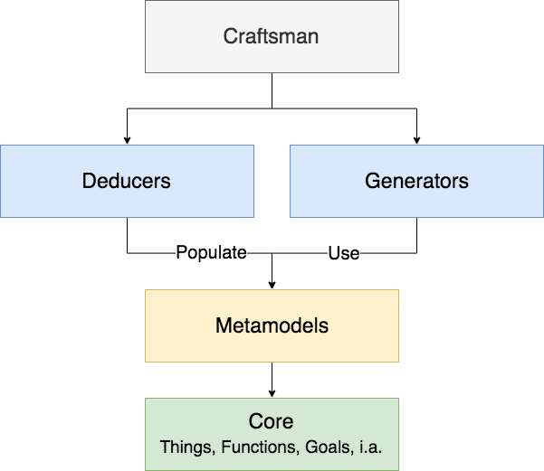

== Introduction

In the modern era, user expectations from an application are significantly higher no more than a few years ago. This fact reflects also the stiff competition of organizations in both local and global markets, virtually in every domain. Today, business applications should be able to adapt fast. They should be user-friendly and well tested. Source code should be qualitative and consistent. Integration to frameworks and external systems should be easily interchangeable and not cumbersome or even prohibitive. New developers joining a team should not be facing high learning curves in the source code.

Not all businesses are there yet, for a variety of reasons. In some teams, each developer follows his/her own coding style due to the lack of constraint mechanisms. There is not always enough time for adequate testing, as the time-to-market is more important to the business. A lot - if not most of the - time is spent on implementing the various layers with repetitive work and less time is spent on the domain model.

PolyGenesis is a novel approach to automatic programming, inspired by Domain-Driven Design and following the Trinity Architecture, aiming to solve the above problems. The various layers and technologies are modeled and instantiated with the proper values. Generators use templates combined with the PolyGenesis models to produce consistent and reliable source code.

=== 10,000ft View

It all starts with the *Things*, *Functions* and *Goals* definitions.
Input is provided via DSL.

The *Metamodels* model the concept that needs to be generated (i.e. API, REST, Persistence etc.)

Once Goals are defined, the *Deducers* are in charge of instantiating and populating the Metamodels, based on Things.

The *Generators*, when fed by the Metamodels, produce source code or any other kind of output.

The whole process is orchestrated by the *Craftsman*.

